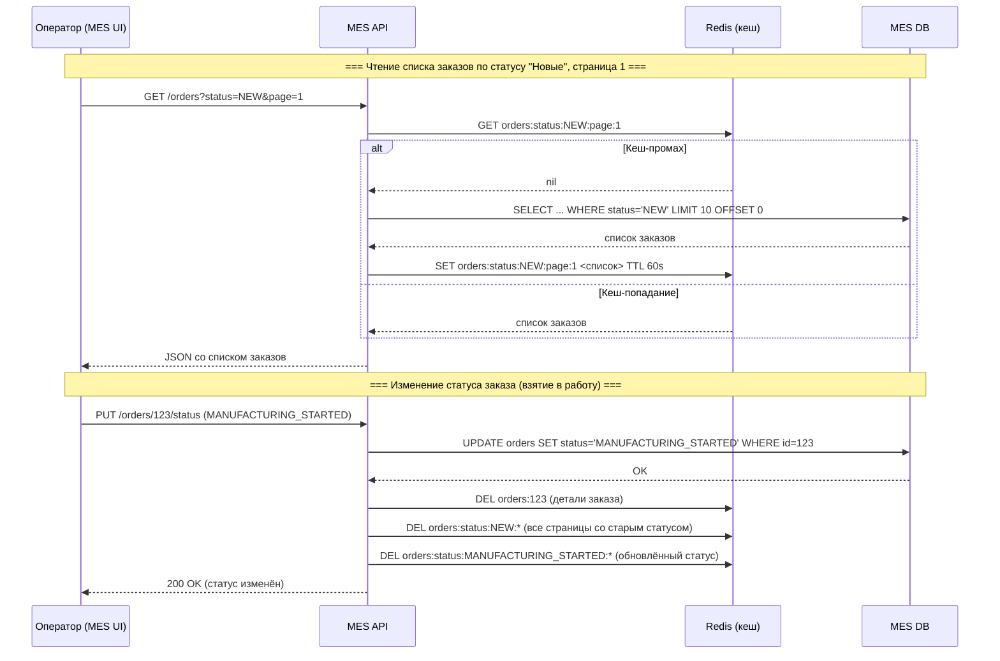

```mermaid
sequenceDiagram
    participant Operator as Оператор (MES UI)
    participant API as MES API
    participant Cache as Redis (кеш)
    participant DB as MES DB

    Note over Operator,DB: === Чтение списка заказов по статусу "Новые", страница 1 ===
    Operator->>API: GET /orders?status=NEW&page=1
    API->>Cache: GET orders:status:NEW:page:1
    alt Кеш-промах
        Cache-->>API: nil
        API->>DB: SELECT ... WHERE status='NEW' LIMIT 10 OFFSET 0
        DB-->>API: список заказов
        API->>Cache: SET orders:status:NEW:page:1 <список> TTL 60s
    else Кеш-попадание
        Cache-->>API: список заказов
    end
    API-->>Operator: JSON со списком заказов

    Note over Operator,DB: === Изменение статуса заказа (взятие в работу) ===
    Operator->>API: PUT /orders/123/status (MANUFACTURING_STARTED)
    API->>DB: UPDATE orders SET status='MANUFACTURING_STARTED' WHERE id=123
    DB-->>API: OK
    API->>Cache: DEL orders:123 (детали заказа)
    API->>Cache: DEL orders:status:NEW:* (все страницы со старым статусом)
    API->>Cache: DEL orders:status:MANUFACTURING_STARTED:* (обновлённый статус)
    API-->>Operator: 200 OK (статус изменён)
```